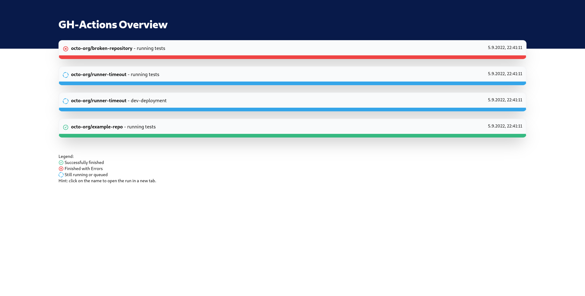

# GH-Actions-Dashboard

Since GitHub does not offer a way to display all running workflows in an organization I hacked together this quick little page.

It uses the GitHub Webhooks for notifications and distributes them to all connected frontends.

What I want to extends this with:
- simple flat-file sqlite Database, for storing information about jobs so there is inital data. 
- add normal workflows and not only jobs
- calculate some fun statistics about jobs for BI
- *Maybe* user-authentication some time
- Integrate GitHub Webhook Authentication with tokens
- Build docker-images and docker-compose file for easy peasy deployments

## Installation
soon :tm:

## Usage
soon :tm:

## Contributing
Pull requests are welcome. For major changes, please open an issue first to discuss what you would like to change.

Please make sure to update tests as appropriate.

## License
[MIT](https://choosealicense.com/licenses/mit/)